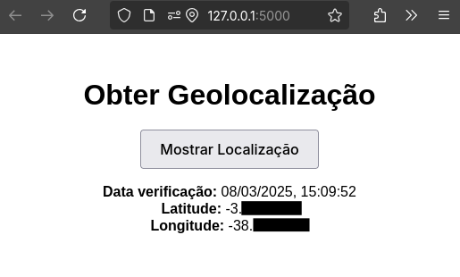

# Projeto de Geolocalização

Este é um projeto simples de uma interface web que obtém e exibe a geolocalização do usuário ao clicar em um botão. O backend utiliza Flask e o gerenciamento de dependências é feito com Poetry.

## Estrutura do Projeto

```
projeto-geolocalizacao
├── app
│   ├── __init__.py
│   ├── __pycache__
│   │   ├── __init__.cpython-310.pyc
│   │   └── routes.cpython-310.pyc
│   ├── routes.py
│   ├── static
│   │   ├── css
│   │   │   └── styles.css
│   │   └── js
│   │       └── geolocation.js
│   └── templates
│       └── index.html
├── app.py
├── poetry.lock
├── pyproject.toml
├── README.md
└── tests
    └── test_app.py
```

## Instalação e Execução

1. **Certifique-se de ter o Poetry instalado**
   
   Caso não tenha o Poetry instalado, siga as instruções em [https://python-poetry.org/docs/#installation](https://python-poetry.org/docs/#installation).

2. **Clone o repositório**
   ```sh
   git clone https://github.com/felipealvss/projeto-geolocalizacao.git
   cd projeto-geolocalizacao
   ```

3. **Instale as dependências com o Poetry**
   ```sh
   poetry install --no-root
   ```

4. **Execute o projeto**
   ```sh
   poetry run python projeto-geolocalizacao/app.py
   ```

5. **Acesse no navegador**
   
   Abra o navegador e acesse:
   
   [http://127.0.0.1:5000/](http://127.0.0.1:5000/)

## Funcionalidades
- Exibe a geolocalização do usuário ao clicar em um botão.
- Registra os dados de latitude, longitude e data/hora em um arquivo `log.txt`.

## Imagem de Exemplo
Aqui está uma imagem de exemplo mostrando as informações geradas pelo projeto:



## Tecnologias Utilizadas
- Python
- Flask
- Poetry
- HTML, CSS e JavaScript

## Autor
Felipe Alves - [LinkedIn](https://www.linkedin.com/in/felipealvss)
